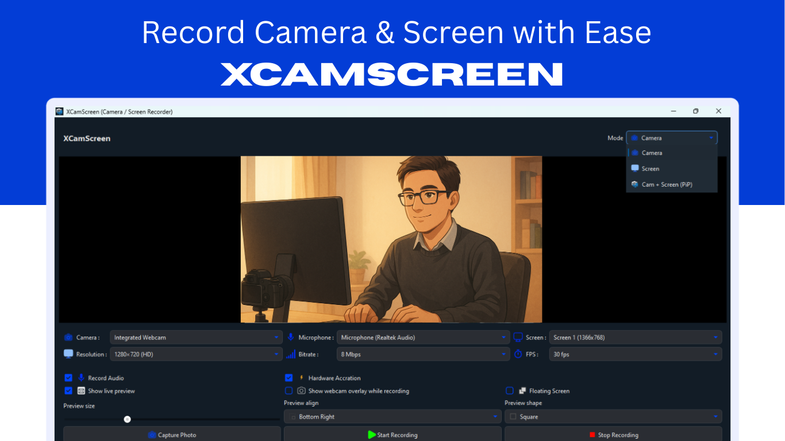
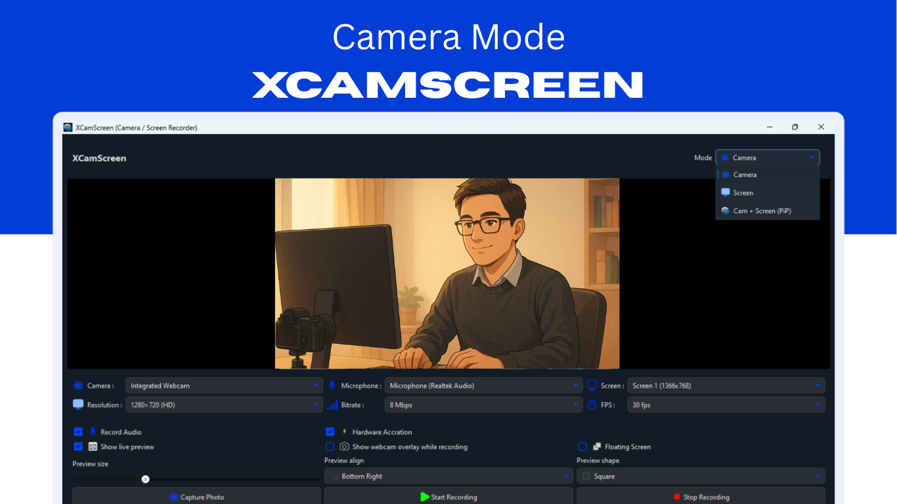
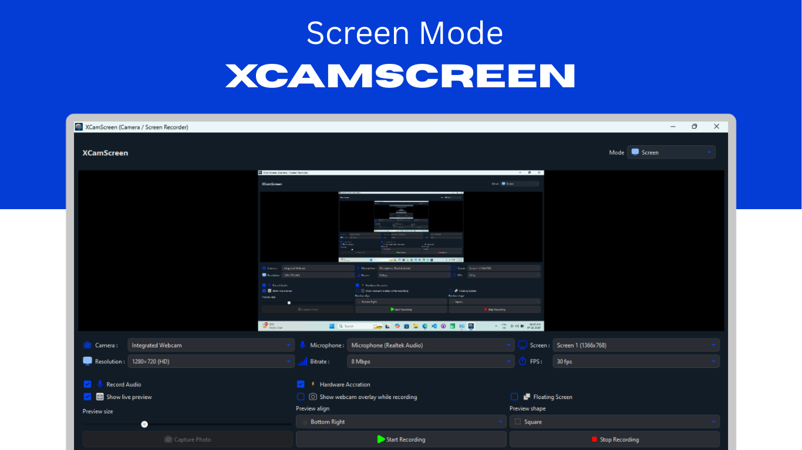

---

# 🎥 XCamScreen — Camera & Screen Recorder

> A fast, offline, and privacy-focused camera and screen recording software built using **Qt C++**.

<p align="left">
  
  
  
  
  
  
  
  
  
  
</p>

<p align="center">
  
</p>

---

## 📥 Download Stable Version (Microsoft Store)

> The safest and most verified download is provided through the **Microsoft Store**.

<!-- Microsoft Store Badge -->

<a href="https://apps.microsoft.com/detail/9pbb1xtrgvmw?referrer=appbadge&mode=direct">
  
</a>

---

## 📌 Overview

**XCamScreen** is a fast and lightweight recording tool that allows you to record your **webcam**, **screen**, or **both together (Picture-in-Picture)** with audio support.
Designed for **teachers, gamers, content creators, professionals, and students** — XCamScreen delivers smooth, high-quality recordings with **zero internet dependency and zero tracking**.

---

## ✨ Features

### 🔹 Recording Modes

| Mode           | Description                            |
| -------------- | -------------------------------------- |
| 🎥 Camera Mode | Records webcam video                   |
| 🖥 Screen Mode | Captures desktop screen                |
| 🔳 PiP Mode    | Records webcam + screen simultaneously |

### 🔹 Additional Capabilities

* 🎤 Microphone audio recording
* ⚡ Hardware acceleration for smoother performance
* 🖼 Capture snapshots anytime
* 🎚 Adjustable resolution, FPS & bitrate
* 📂 Automatic file saving to selected folder
* 🔐 **100% offline recording — no cloud uploads, no tracking**

---

## 🧠 Tech Stack

| Component      | Technology                  |
| -------------- | --------------------------- |
| Language       | C++                         |
| Framework      | Qt 6 (Widgets + Multimedia) |
| Video Encoding | FFmpeg / Qt Multimedia      |
| Platform       | Windows                     |

---

## 🖼 UI Preview

| Screen                | Preview            |
| --------------------- | ------------------ |
| Home / Preview Window |  |
| Camera Mode           |  |
| Screen Mode           |  |
| Picture-in-Picture    |  |

> 📌 Add screenshots to the `/preview/` folder with correct names to render automatically.

---

## 🛠 Installation

### 🔹 Windows (Recommended)

1. Download `XCamScreen_Setup.exe` from the **Releases** page
2. Run the installer
3. Launch from the Desktop or Start Menu

### 🔹 Manual Build (Developers)

```bash
git clone https://github.com/arshc0der/XCamScreen.git
cd XCamScreen
```

> Requires **Qt 6 Multimedia**, **C++ compiler**, and **CMake / qmake**

---

## 🚧 Known Issues

* ❗ Webcam + Screen recording performance depends on hardware
* 🔄 Currently available only for **Windows**
* 🧪 Linux / macOS support may be added later

Found a bug? Report it here:
👉 [https://github.com/arshc0der/XCamScreen/issues](https://github.com/arshc0der/XCamScreen/issues)

---

## 🤝 Contributing

Contributions are welcome!
To contribute:

1. 🍴 Fork the repository
2. 🛠 Add your improvements or features
3. 🔁 Submit a Pull Request

If you like this project, please ⭐ **star the repo** to support continued development!

---

## 📢 Stay Connected

| Platform    | Link                                                                                             |
| ----------- | ------------------------------------------------------------------------------------------------ |
| GitHub      | [https://github.com/arshc0der](https://github.com/arshc0der)                                     |
| Issues      | [https://github.com/arshc0der/XCamScreen/issues](https://github.com/arshc0der/XCamScreen/issues) |

---

## 📜 License

This project is distributed under the **MIT License**.
© 2025 [Arsh](https://github.com/arshc0der)

---

### ❤️ Made with passion for creators, teachers, streamers, and professionals.

> **XCamScreen — Your screen + webcam in one click. 100% offline. 100% private.**

---

